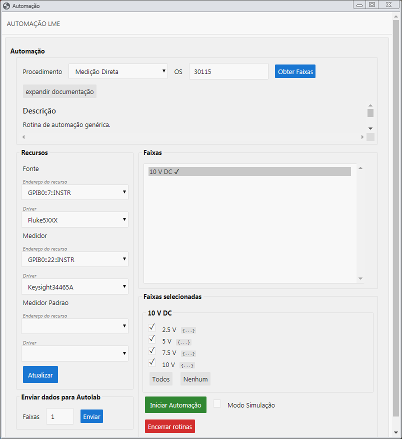
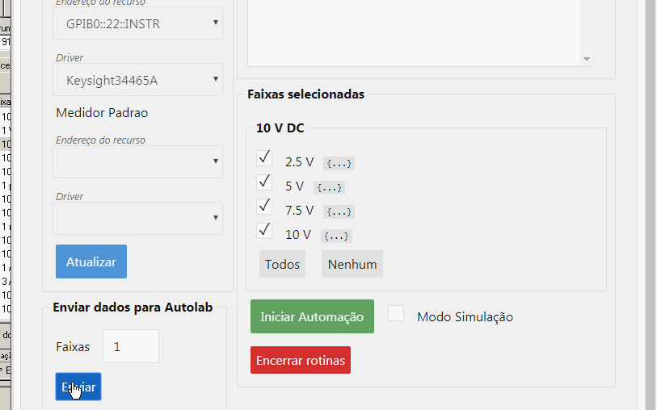

# Software AAutolab

## Histórico e Proposta do _software_

O software `AAutolab` foi desenvolvido como uma solução de automação para as situações em que o software Autolab não consegue atender. É desenvolvido utilizando a linguagem Python, possui interface gráfica e integração com o Autolab.

## Iniciando o _software_

Para iniciar o `AAutolab`, recomenda-se que seja feita uma cópia da pasta "I:\LME\AREAS_TECNICAS\AUTOMACAO\AAutolab" e que tenha o `WinPython` em seu computador, como foi feito na introdução ao Python. No entanto, é possível iniciar o programa diretamente pela rede. Para ambos os casos, basta executar o arquivo `AAutolab.bat` e aguardar a tela inicial aparecer. Isto pode demorar um pouco mais na primeira vez e o console deve permanecer aberto.

### Obtendo dados do Autolab

Informe o número da ordem de serviço e clique em "Obter Faixas". Em instantes uma lista irá aparecer com as faixas da calibração. Clique nelas para visualizar os pontos a serem calibrados. Caso a calibração não tenha uma ordem de serviço, você também pode utilizar o código da calibração. Para descobrir este código no Autolab, na calibração pressione "Ctrl+Alt+R".

### Executando uma automação

Foi criada uma calibração para testes com código 30115 que será utilizada como exemplo. Utilize este código como número de OS e clique "Obter Faixas" para acompanhar acompanhar o exemplo. Em seguida, no menu "Procedimento" escolha "Medição Direta". Uma documentação sobre a rotina é disponibilizada no aplicativo.

Você poderá selecionar os _drivers_ e endereços dos instrumentos no painel "Recursos".  Os mesmos instrumentos utilizados no projeto serão utilizados neste exemplo. 



Com todos os instrumentos conectados, clique em "Iniciar Automação". Todos os passos executados são mostrados no console.

Após finalizada, você poderá transferir as leituras para o Autolab clicando em "Enviar". A janela do Autolab da faixa calibrada deverá estar aberta.



Não é necessário selecionas as faixa no AAutolab, pois o software sabe quais os dados a serem transferidos pelas informações que ele obtém no Autolab. Ao definir o número de faixas, o software irá repetir o processo de transferência para as faixas seguintes.

## Desenvolvendo _drivers_ e rotinas

A estrutura do AAutolab é semelhante ao projeto que desenvolvemos. O principal forma de expandir o seu uso é por meio do desenvolvimento de testes, _drivers_ e rotinas. Inclusive, o teste é uma fator muito importante, pois não queremos que ao alterar a parte de uma rotina algo supostamente não relacionado pare de funcionar.

Para desenvolver um novo _driver_, a melhor forme é tomar como referência um semelhante e alterar os comandos. O `KeysightU2000` é um bom começo.

Para desenvolver uma nova rotina podemos seguir a mesma regra. Um _template_ para a rotina de automação seria uma classe>

```python
class Rotina(RotinaBase):
  """
#### Descrição

Aqui podemos escrever uma documentação que vai aparecer na tela do software

  """
  def __init__(self, recursos, modo_simulacao = True):
    super(Rotina, self).__init__(modo_simulacao)

    self.fonte = self.instrumento(recursos['Fonte'])
    self.medidor = self.instrumento(recursos['Medidor'])
    
    
  def rotina(self, pontos, acao_n = 0):
    fonte = self.fonte
    medidor = self.medidor

    # Escreva a lógica da lógica. No final devemos retornar um dicionário com a seguinte estrutura:
    results = [
      { "VC1": [ 1.0, 1.0, 1.0 ], "VI": [ 1.001, 1.002, 1.001 ] },
      { "VC1": [ 2.0, 2.0, 2.0 ], "VI": [ 2.002, 2.002, 2.003 ] }
    ]
    
    return results
```

No entanto, não altere o código que está na rede. Faça alterações apenas no código em seu computador e depois converse com @arturm para saber como podemos aplicar as alterações em uma nova versão. Vamos utilizar o sistema para controle de versão Git e tentar escrever testes (veja a pasta `tests` para ter uma ideia).


Fim do tutorial. Algum conteúdo que foi inicialmente escrito e depois retirado do tutorial e algumas ideias de tópicos para serem abordados futuramente podem ser consultados em [extras](./extras.md).