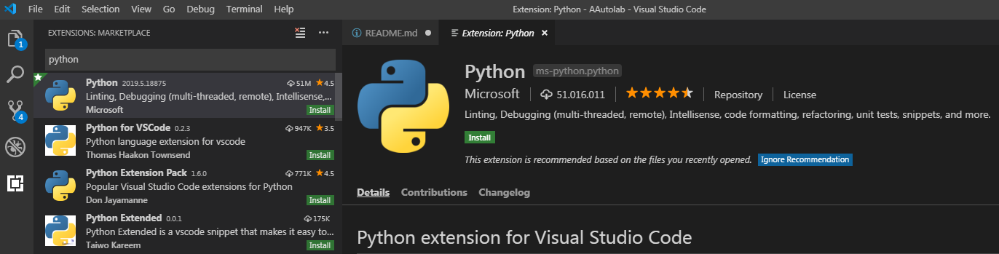
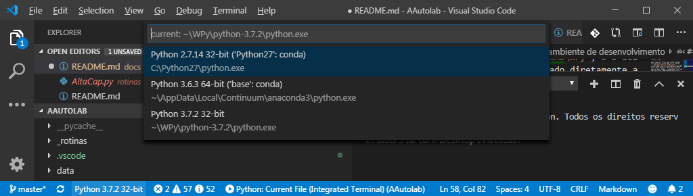
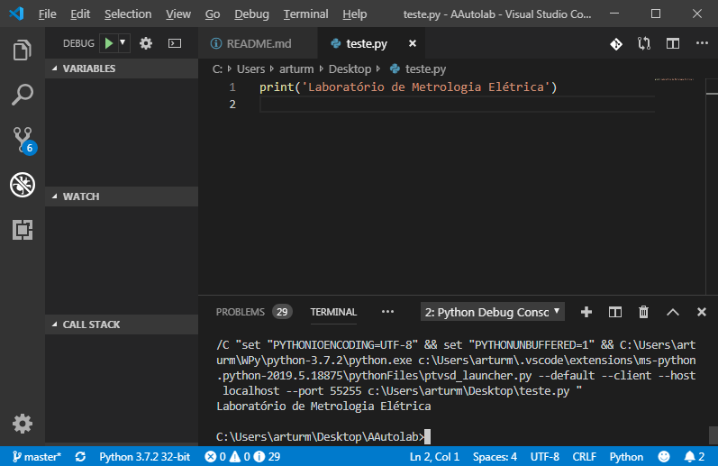
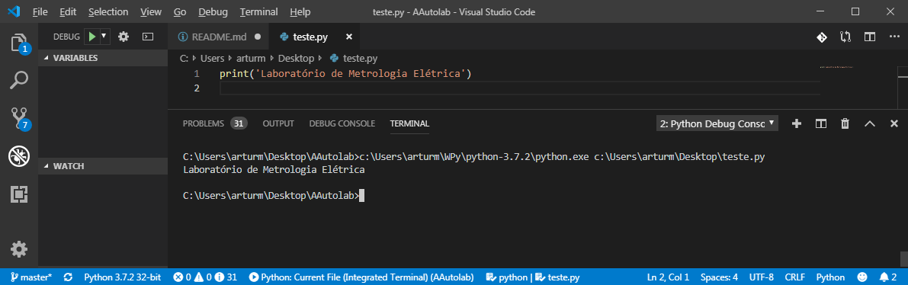

# Extras

## Utilizando o editor de código Visual Studio Code

Caso queira utilizar um editor com muitas funcionalidades e gratuito, recomendo utilizar o Visual Studio Code (`VSCode`), que pode ser obtido em https://code.visualstudio.com/.

Após baixar e instalar, será necessário instalar algumas extensões. Com o editor aberto, clique em `View`>`Extensions` e digite `python` na caixa de busca. Instale a primeira opção que deverá aparecer publicada mela `Microsoft`, conforme figura:



Após instalar a extensão, verifique se o `Python` foi identificado pelo `VSCode`. Na barra de ferramentas que aparece na parte inferior do editor, deverá aparecer algo como a figura a seguir:



Caso em seu computador já exista outras distribuições python instalada, como é o caso do meu, mais de um item aparecerá na lista. Certifique-se que o item escolhido é o que começa com `~\WPy\`.

### Criando e Executando o primeiro programa com o `VSCode`

Com o ambiente de desenvolvimento instalado e configurado, vamos escrever um programa em python bem simples, para testar se tudo está funcionando.

* Crie um novo arquivo clicando em `File`>`New File`
* Aperte `Ctrl+s` e salve o arquivo no seu desktop com o nome `teste.py`
* No editor, digite o código abaixo:

```python
print('Laboratório de Metrologia Elétrica')
```

Pressione a tecla `F5`. Um terminal irá aparecer na parte inferior do `VSCode` e o texto `Laboratório de Metrologia Elétrica` será escrito. O texto que aparece antes é o comando utilizado pelo `VSCode` para evocar o script.



Esta é a forma mais conveniente de executar o programa. Uma outra forma é digitar no terminal o caminho completo do interpretador `Python` em seguida o caminho do arquivo `teste.py` como demonstrado na imagem:




## Ideia: Tutorial sobre AutoHotkey

Como utilizar esta linguagem para automatizar tarefas e sua integração com o Python

## Ideia: Curso de digitalização com o multímetro 3458A

Como usar os recursos de digitalização do 3458A e algumas aplicações (Curso desenvolvido para Eletronuclear) 

## Ideia: Tutorial de Arduino

Utilizando o Arduino + Python

## Ideia: Web Scraping + Data mining

Demonstrar o que é feito no robô do ProCal para extrair e-mails e outras informações do Autolab

