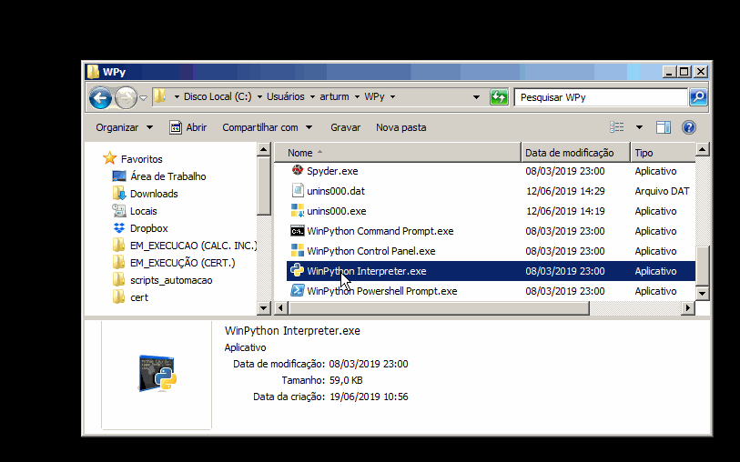
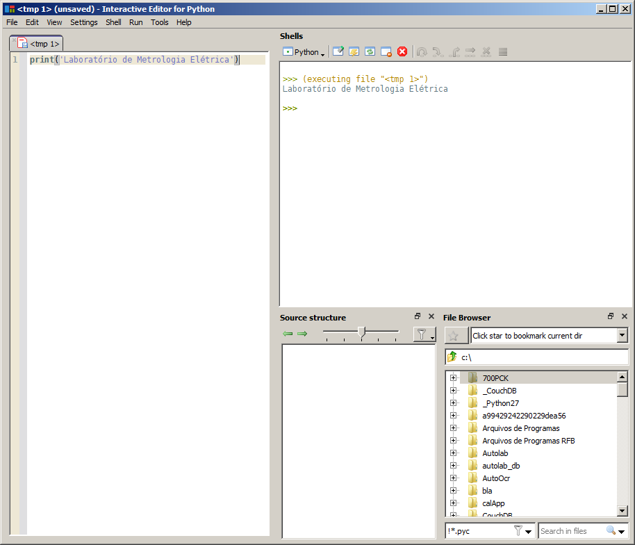

# Introdução ao Python

O Python é uma linguagem de programação de alto nível, como uma sintaxe fácil de ler e escrever. A grande quantidade de funções e bibliotecas de software já existentes para instrumentação e análise numérica tornam esta linguagem tão popular para aplicações de laboratório.

No laboratório o Python é utilizado em diversas tarefas:

- Automação de instrumentos
- Ajuste de instrumentos de alta precisão
- Geração automática de certificados de calibração para algumas placas da National Instruments
- Ferramenta para realização de estudos e artigos 
- Extração automática de dados de e-mails e páginas
- Integração entre ProCal e Autolab

# Configurando o ambiente de desenvolvimento

## Distribuições Python

Para executar programas feitos na linguagem Python é necessário baixar e instalar uma distribuição do interpretador. Para facilitar a compreensão, podemos dizer que o Python nada mais é do que um aplicativo que interpreta e executa instruções definidas em um arquivo `.py`, da mesma forma que o `Excel` faz com um arquivo `.xlsm`.

Para o sistema operacional Windows, as distribuições mais conhecidas são:

### WinPython
- Site: https://winpython.github.io/
- Características: Diversas bibliotecas preinstaladas. Não precisar ser instalado, basta descompactar um arquivo e executar, o que é uma grande vantagem.

### Python oficial
- Site: https://www.python.org/downloads/windows/
- Características: Oferece uma distribuição contendo apenas as bibliotecas nativas. Por este motivo é de rápida instalação, no entanto necessita de um esforço maior para utilizar bibliotecas de terceiros.

### Python Anaconda
- Site: https://www.anaconda.com/distribution/
- Características: Diversas bibliotecas preinstaladas, portanto o arquivo de instalação é bem grande. Oferece suporte comercial. É utilizada no laboratório, mas está sendo substituída pelo `WinPython` em novos projetos.

Ao realizar o download das distribuições, você terá a opção de de baixar a versão `32bit` e `64bit`. Para as aplicações do laboratório escolha sempre a `32bit`. A maioria dos _drivers_ utilizados nas placas para a automação de instrumentos são desenvolvidos para `32bit`, tornando a versão Python `64bit` incompatível. Os drivers desenvolvidos para `64bis` por sua vez, são compatíveis com o Python `32bit`.

A distribuição Python que será utilizada neste documento é a WinPython e está disponível na rede em `I:\LME\AREAS_TECNICAS\AUTOMACAO\WPy` e o seu interpretador pode ser executado diretamente a partir deste diretório. No entanto para uma execução mais rápida, é recomendável fazer uma cópia da versão compactada deste diretório (WPy.zip) e descompacta-lo em `%userprofile%` ou C:\Users\\<seulogin\>. Desta forma a velocidade de acesso ao interpretador do Python não irá depender da rede.

Após copiar e descompactar os arquivos, abra a pasta e execute o arquivo `WinPython Control Panel.exe`. Em seguida clique em `Advanced`>`Register distribution...` e confirme. Isto irá criar um registro do Python no Windows, que será útil para integra-lo a um editor de código.

## Interagindo com o interpretador do Python

Uma boa forma de testar e estudar uma [linguagem interpretada](https://pt.wikipedia.org/wiki/Linguagem_interpretada) como é o caso do Python é interagindo com seu interpretador comando por comando no modo [REPL](https://en.wikipedia.org/wiki/Read-eval-print_loop). Neste modo você poderá digitar uma linha de código e obter o resultado imediatamente. 

Para fazer isto, abra o arquivo `WinPython Interpreter.exe` que está localizado na pasta onde o `WinPython` foi descompactado. 

Quando a janela abrir, deverá aparecer `>>>` escrito, que é onde você irá escrever os comandos. Vamos utilizar o comando `print` para exibir um texto na tela:



Tente fazer o mesmo, mas utilizando o arquivo `IPython Qt Console.exe`. Você irá observar que este console se comporta de forma diferente ao anterior e oferece outras funcionalidades, como a geração de relatórios e maior flexibilidade ao copiar/colar partes de código.

Caso algum comando seja informado de forma incorreta, o interpretador irá exibir uma mensagem e erro mas continuará aberto, aguardando a execução de um novo comando.

## Editor de código

Para editar os script Python você precisará de um editor de código. Por ser fácil de usar e rápido, recomendo começar utilizando o editor `Pyzo` que vem com a distribuição `WinPython`.

### Utilizando o `Pyzo` como editor

Abra o arquivo `Pyzo.exe` que aparece no diretório `WPy`. Em instantes irá aparecer um editor de código, um interpretador e um navegador de diretórios e tudo já estará configurado para que você comece o desenvolvimento de programas em Python.

Digite o seguinte código no editor:

```Python
print('Laboratório de Metrologia Elétrica')
```

Em seguida, pressione `F5`. O texto deverá aparecer ao lado, como mostra a figura



Quando o seu código tiver diversas linhas você pode ainda executar apenas linhas selecionadas utilizando `Alt+Enter`.

## Pacotes

Uma pacote é um programa que desempenha uma série de funcionalidades que você pode integrar ao seu programa. Uma das maiores qualidades da linguagem Python é a vasta biblioteca de pacotes existente.
Um local onde você pode pesquisar por bibliotecas é no site https://pypi.org/. 

A distribuição Python disponível para executar os programas do LME já contem todas as bibliotecas necessárias instaladas. Para instalar novos pacotes, podemos utilizar o comando `pip`.

Caso tenha a necessidade de instalar um novo pacote, a forma mais fácil de fazer isto é abrindo o arquivo `WinPython Command Prompt.exe` localizado na pasta onde o `WinPython` foi descompactado e digitar o comando `pip install <nome do pacote>`. Isto irá garantir que o pacote será instalado na distribuição `WinPython`. 

> Note que este *prompt* de comando não é da linguagem Python e sim do `MSDOS`.

# Conceitos básicos da linguagem

A seguir serão apresentados os conceitos básicos da linguagem Python. Já existem muitos tutoriais com estes conceitos na internet, portanto para não repeti-los, foi adotada uma abordagem mais próxima de nossas aplicações.

Durante este tópico, é recomendável manter o interpretador do Python aberto para testar o que é descrito.

## Variáveis 

[Variáveis](https://www.programiz.com/python-programming/variables-datatypes) são utilizadas para armazenar dados. Estes podem ser escalares, como por exemplo um valor numérico da leitura de um multímetro ou estruturas de dados, como vetores, matrizes, dicionários, etc. 

Execute o comando abaixo para atribuir um valor a uma variável e depois exibi-lo na tela:

```Python
temperatura = 23
print('Temperatura da sala: ', temperatura)
```

Observe o uso do `print` para mostrar dois valores em uma mesma linha.

Saiba que não podemos utilizar alguns nomes ao definir novas variáveis, pois estes são [reservados](https://www.programiz.com/python-programming/keywords-identifier) pela linguagem Python. Os nomes que não podemos utilizar são:

`False` `class` `finally` `is`  `return`
`None`  `continue`  `for` `lambda`  `try`
`True`  `def` `from`  `nonlocal`  `while`
`and` `del` `global`  `not` `with`
`as`  `elif`  `if`  `or`  `yield`
`assert`  `else`  `import`  `pass`   
`break` `except`  `in`  `raise`

> O nome de uma variável pode conter letras minúsculas *(a até z)* ou maiúsculas *(A até Z)*, `_` e dígitos *(0 até 9)*. 
> Não pode começar com um número ou conter acentos. O mesmo nome com letras maiúsculas ou minúsculas representam variáveis *diferentes*.

### Valores Numéricos

Valores numéricos podem ser inteiros (`int`), ponto flutuante (`float`) ou complexos (`complex`).

Execute o código abaixo para definir variáveis com valores numéricos.

```Python
tensao_medida = 12.02
impedancia_medida = 3+4j
leituras_realizadas = 4
```

> Observe que deve-se sempre utilizar ponto como separador decimal.

### Listas

Uma lista (`list`) representa uma sequencia ordenada de itens. Os itens devem ser separados por virgula e podem ser de tipos diferentes para uma mesma lista.

```Python
# Definindo uma lista vazia
leituras = []
# Adicionando itens à lista
leituras.append(10.0001)
leituras.append(10.0005)
leituras.append(10.0040)
leituras.append(10.0003)
# mostrando o conteúdo da lista
print(leituras)
# Poderíamos também definir a lista de uma só vez da seguinte forma:
leituras2 = [10.0001, 10.0005, 10.0040, 10.0003]
# vamos agora consultar os dados armazenados na lista
print('Primeiro item da lista: ', leituras[0])
print('Segundo e terceiro item da lista: ', leituras[1:3])
print('Último item da lista: ', leituras[-1])
print('Dois últimos itens da lista: ', leituras[-2:])

leituras[2] = 10.0004 # Alterando um item da lista
```

> Note que no código, as linhas que começam com *#* ou tudo que vem à sua direita são comentários e portanto não serão executados. Servem apenas para documentar o código.
> Para consultar os itens da lista é utilizado *[]* à direita de seu nome. As listas São indexadas começando em 0. 
> A consulta *[1:3]* não incluí o ultimo item da lista

### Tuplas

Uma Tupla (`tuple`) é semelhante a uma lista, mas após ser criada não pode ser alterada. São definidas utilizando `()` e seus itens são separados por vírgula.

```Python
canais_do_osciloscopio = ('ch0', 'ch1', 'ch2', 'ch3')
# Vamos tentar alterar a tupla. Isto vai gerar um erro
canais_do_osciloscopio[0] = 'ch4'
```

> Por serem apenas leitura, tuplas são mais rápidas que listas

### Strings

Strings (`str`) é uma sequencia de caracteres. Utilizamos aspas simples `'...'` ou aspas duplas `"..."` para representa-las. Podemos também utilizar uma sequência de três aspas (`'''` ou `"""`) para definir uma string com múltiplas linhas.

```Python
nome_da_faixa = 'Faixa de 0 a 10 mA AC'

ema_da_faixa = """
EMA: (10 ppm do valor indicado) para valores até 5 mA e
     (15 ppm do valor indicado) para valores acima de 5 mA"""

print(nome_da_faixa, ema_da_faixa)

# Partes das strings podem ser consultadas da mesma forma que listas
unidade_da_faixa = nome_da_faixa[16:18]
print(unidade_da_faixa)
```

### Dicionários

Um Dicionário (`dict`) é uma coleção de valores identificados por um "valor chave". São definidos utilizando `{}`.

```Python
# Iniciando um dicionário vazio
medicao = {}
# atribuindo valores
medicao['VI'] = 10.01
medicao['VC'] = 10.0005

chave = 'VI'
# Mostra a leitura VI
print(medicao[chave])

chave = 'VC'
# Mostra a leitura VC
print(medicao[chave])
# Mostra todas as chaves definidas na variável `medicao`
print(list(medicao.keys()))
```

### Conversão entre tipos de variáveis

As vezes precisamos que um tipo de variável se comporte como outro tipo. Para isto, devemos utilizar uma função para converter a variável quando possível.

Execute os comandos abaixo com alguns exemplos:

```Python
# Definindo a variável `string_com_numero` contento a representação do número
string_com_numero = '10.05 '
# Utilizando a função float para converter uma string em número
# a variável `numero` receberá o valor em formato float
numero = float(string_com_numero)
print(numero)
# No próximo comando, o interpretador irá apresentar um erro, pois o texto informado não pode ser convertido diretamente para um valor numérico
numero = float('10.07 mV')
# Como agora vamos selecionar apenas a parte do texto contendo a representação numérica, a conversão ocorrerá com sucesso.
numero = float('10.07 mV'[0:5])
print(numero)
# Da mesma forma podemos converter o número para uma string. Observe que o comando abaixo será executado sem a atribuição do resultado à uma variável. Executando um comando desta forma no interpretador o resultado é exibido imediatamente no terminal
str(numero)
# Note o resultado aparece entre '', indicando que o valor é uma string.
```

Em algumas situações a conversão numérica pode ocorrer de forma `implícita`. Teste alguns exêmplos:

```Python
# A soma abaixo de um inteiro com um float irá resultar em um float
resultado = 1+1.02
print(resultado)
# Podemos utilizar o comando `type` para verificar o tipo de variável
type(resultado)
```

## Trabalhando com expressões e operadores

Expressões são utilizadas para realizar operações com valores. [Operadores](https://www.programiz.com/python-programming/operators) são símbolos que realizam operações matemáticas ou lógicas entre valores ou estrutura de dados. A soma realizada no item anterior é um exêmplo de operação, onde o simbolo `+` é o operador indicando que desejamos realizas a soma e o sinal de igual `=` indica que queremos atribuir o resultado à variável.

Os tipos de operadores podem ser divididos entre operadores aritméticos, de comparação, lógicos, binários, atribuição  e operadores especiais. Confira na página (https://www.programiz.com/python-programming/operators)[https://www.programiz.com/python-programming/operators] uma explicação mais detalhada sobre todos os operadores. Não se preocupe caso não entenda totalmente como se utiliza alguns dos operadores, pois ao decorrer do curso o uso destes ocorrerá em aplicações práticas e desta forma o entendimento será mais fácil.

Para uma breve introdução ao uso dos operadores mais comuns, execute os comandos abaixo.

```Python
# Assim como na matemática o uso de parênteses altera a precedência dos operadores
a = (1+2)/3
b = 1+2/3
print(b == a) # False

print(20/2 > 10) # False
print(2*5 >= 10) # True

# Podemos utilizar o operador especial de identidade para verificar se existe um valor em uma lista
pontos = [2.5, 5, 7.5, 10]
print(5 in pontos) # True
print(3 in pontos) # False

# Pode ser utilizado também em strings
solicitacao = 'Calibração em tensão, corrente e resistência.'
print('tensão' in solicitacao) # True
print('frequência' in solicitacao) # False

# Ponto de 10 V calibrado
print('tensão' in solicitacao and 10 in pontos) # True

# Podemos somar listas
pontos_adicionais = [25, 50, 75, 100]
print(pontos + pontos_adicionais) # [2.5, 5, 7.5, 10, 25, 50, 75, 100]

# Ao multiplicar listas ou strings repetimos o seu conteúdo
print(['x'] * 10) # ['x', 'x', 'x', 'x', 'x', 'x', 'x', 'x', 'x', 'x']
print('x' * 10) # 'xxxxxxxxxx'
```

## Utilizando condicionais

É comum condicionar a execução de um certo trecho de código em função de valores predefinidos e calculados.

Para isto, podemos utilizar o `if`, `elif` e o `else`.

Execute os comandos abaixo.

```Python
leitura = 50


if leitura < 1:
  print('utilizar faixa de 1 V')
elif leitura < 10:
  print('utilizar faixa de 10 V')
elif leitura < 100:
  print('utilizar faixa de 100 V')
else:
  print('utilizar faixa de 1000 V')

unidade_da_faixa = 'V'

# utilizando operadores para verificar condição
if leitura > 1 and unidade_da_faixa == 'V':
  print('Faixa acima de 1 V')


```

## Obtendo informações do usuário

É possível interromper a execução de um programa para que o usuário informe algo que será utilizado no software.
Para isto, utilizamos o comando `input`.

O código abaixo mostra uma mensagem solicitando que o técnico informe o código do instrumento e em seguida mostra este código na tela:

```Python
codigo_do_instrumento = input('Informa o código do instrumento:')
print(codigo_do_instrumento)
```
Obs: A entrada o `input` será sempre uma string. Caso queira utilizar como um número, por exemplo, você devera realizar a conversão.

```Python
# importa funções matemáticas
import math

rms = float(input('Informe o valor RMS:'))
vpp = rms*2*math.sqrt(2)
```

## Repetindo operações em `loops`

Parte de um código pode ser executado mais de uma vez utilizando instruções de loops `for` e `while`.

O loop `for` é utilizado quando você tem uma lista predefinida.

```Python
pontos = [2.5, 5, 7.5, 10]
for ponto in pontos:
  print('Calibrar o ponto de '+ str(ponto) +' V')

```

O loop `while` é utilizado quando você quer executar um trecho de código até que uma condição seja atendia

```Python
valor = None
valores = []
while valor != 's':
  if valor:
    valores.append(valor)
  valor = input('informe um valor(ou s para sair): ')
print('Você informou os valores:', valores)

```

## Funções

Permitem que um código seja executado em função de argumentos. É definida pela instrução `def` e uma lista de argumentos.

No exemplo a seguir, vamos definir uma função que calcula a lei de Ohm tendo como argumentos o valor da resistência e da corrente.

```Python
def queda_de_tensao(r, i):
  return r*i

# obtém queda de tensão de 5 V
v = queda_de_tensao(10, 0.5)
print(v)
```

Funções podem receber um número indefinido de argumentos utilizando um `*` antes do argumento:

```Python
def queda_de_tensao_resistores_serie(i, *r):
  r_total = 0
  for r_val in r:
    r_total = r_total + r_val
  return i*r_total
  
# obtém queda de tensão de 10 V
v = queda_de_tensao(1, 5, 5)
print(v)
```

> Apenas um argumento com `*` pode existir na definição da função.

Podemos também nomear os argumentos utilizando `**`. O argumento irá se comportar como um dicionário:

```Python
def queda_de_tensao_divisor(v, **rdiv):
  return v * (rdiv['queda']/(rdiv['carga'] + rdiv['queda']))

# obtém 4 V na tensão de saída
v = queda_de_tensao_divisor(12, carga = 100, queda = 50)
print(v)
```

Funções podem ser definidas com apenas um argumento com `*` e `**` definidos nesta ordem. Estes são normalmente chamados de \*args and \*\*kwargs.

## Classes

Uma Classe é uma estrutura de dados que premite representar objetos. 

A partir dela podemos criar os objetos (ação que é chamada de "instanciar"), estender uma classe base (herdando suas características) atribuir e modificar propriedades.


Observe um exemplo de definição de classe:

```Python
class Fonte(object):

  def aplica_sinal(self):
    print('Aplicando sinal')

  def desliga_sinal(self):
    print('Sinal desligado')

# cria uma instancia da classe Fonte
fonte = Fonte()
fonte.aplica_sinal()
fonte.desliga_sinal()
```

> Como convenção, o nome da classe começa com letra maiúscula.


Dentro da definição da classe, as funções que tem `self` como primeiro argumento são chamados de **métodos**.

Vamos agora criar uma classe que estende `Fonte`, permitindo definir a tensão de saída:

```Python
class FonteDeTensao(Fonte):

  def aplica_sinal(self, valor):
    print('Aplicando sinal de {} V'.format(valor))

# cria uma instancia da classe FonteDeTensao
fonte = FonteDeTensao()
fonte.aplica_sinal(10)
fonte.desliga_sinal()
```

A definição `class FonteDeTensao(Fonte)` cria uma classe que herda todos os métodos da classe `Fonte`. Isto pode ser comprovado quando chamamos o método `desliga_sinal` e este é executado conforme foi definido na classe `Fonte`. Verificamos também que o método `aplica_sinal` foi substituído por um novo que exibe a amplitude da tensão aplicada.


Ao declarar classes, podemos também definir uma função `__init__` que é executada quando o objeto é instanciado. Vamos reescrever a classe definindo uma valos de amplitude inicial:

```Python
class FonteDeTensao(Fonte):
  def __init__(self, amplitude = 0):
    self.amplitude = amplitude

  def aplica_sinal(self, valor):
    print('Aplicando sinal de {} V'.format(valor))
    self.amplitude = valor

# cria uma instancia da classe FonteDeTensao
fonte = FonteDeTensao()
print(fonte.amplitude) # mostra 0
fonte.aplica_sinal(10)
print(fonte.amplitude) # mostra 10
fonte.desliga_sinal()
```

Observe com é possível monitorar a qualquer momento o valor da amplitude do objeto.


E se quisermos criar uma nova classe que herda todas as características de `FonteDeTensao`, incluindo a amplitude inicial definida em `__init__`, mas que também implementa uma nova função de inicialização? Para isto, utilizamos a função `super`. 

O exemplo abaixo cria uma classe para uma fonte de tensão alternada com base na fonte de tensão mas não inicia explicitamente o valor inicial de amplitude e sim um valor de frequência. O valor da amplitude é definido implicitamente através da função `super`, como mostrado abaixo:

```Python
class FonteDeTensaoComFrequencia(FonteDeTensao):
  def __init__(self):
    super().__init__()
    self.frequencia = 60

  def aplica_sinal(self, valor):
    print('Aplicando sinal de {} V e {} Hz'.format(valor, self.frequencia))
    self.amplitude = valor

# cria uma instancia da classe FonteDeTensaoComFrequencia
fonte = FonteDeTensaoComFrequencia()
print(fonte.amplitude) # mostra 0
fonte.aplica_sinal(10)
print(fonte.amplitude) # mostra 10
print(fonte.frequencia) # mostra 60
fonte.desliga_sinal()
```

Podemos também definir qual é a amplitude inicial dos objetos criados pela classe `FonteDeTensaoComFrequencia` definindo o argumento `amplitude` no método `super().__init__`:

```Python
class FonteDeTensaoComFrequencia(FonteDeTensao):
  def __init__(self):
    super().__init__(amplitude = 5)
    self.frequencia = 60

  def aplica_sinal(self, valor):
    print('Aplicando sinal de {} V e {} Hz'.format(valor, self.frequencia))
    self.amplitude = valor

# cria uma instancia da classe FonteDeTensaoComFrequencia
fonte = FonteDeTensaoComFrequencia()
print(fonte.amplitude) # mostra 5
fonte.aplica_sinal(10)
print(fonte.amplitude) # mostra 10
print(fonte.frequencia) # mostra 60
fonte.desliga_sinal()
```


Próximo: [Desenvolvendo um software de automação](./projeto.md)
