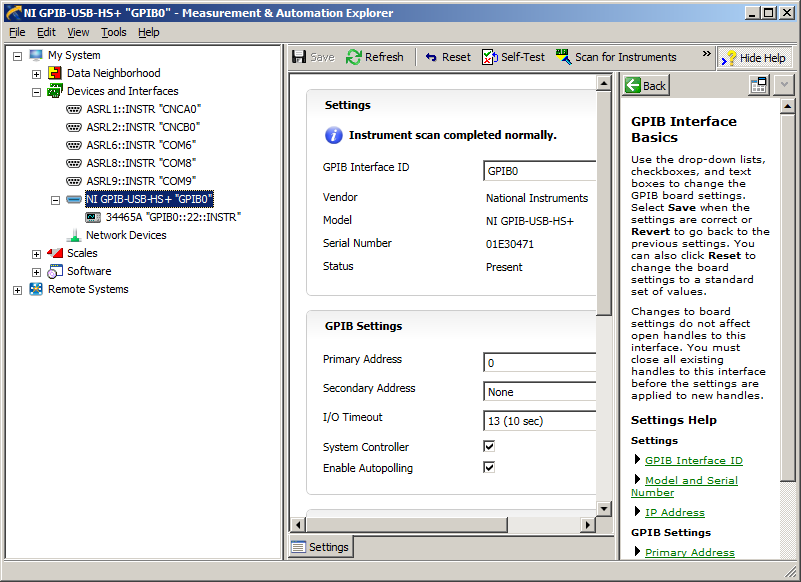
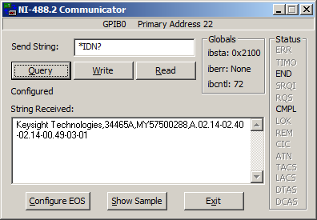
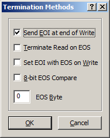
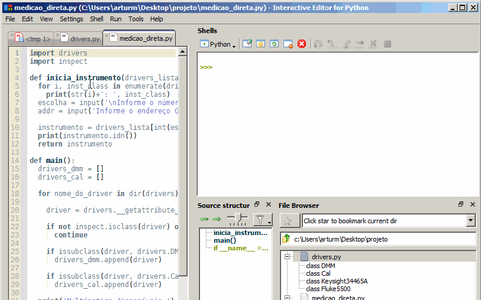
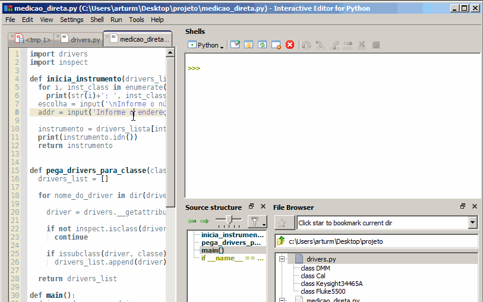

# Projeto: Desenvolvendo um software de calibração

## Objetivos do projeto

Com conceitos básicos apresentado da linguagem `Python` e com informações complementares sobre interfaces e arquiteturas de comunicação utilizadas nas automações, estaremos aptos a desenvolver uma software modular para automação de instrumentos.

A proposta é conceber a estrutura básica de um sistema, com a finalidade entender como e porque devemos abstrair parte do código para que este seja mais reutilizável, apresentando de forma didática os conceitos aplicados em outros projetos de automação para que estes possam ser melhor utilizados e expandidos.

## Interfaces de automação utilizadas no laboratório

Dentre diversos tipos de interfaces de comunicação existentes, a GPIB e RS232 são as mais utilizadas no laboratório.

Estas possuem as seguintes principais características:

- GPIB

Permite que diversos instrumentos sejam conectados em paralelo e alta taxa de transferência. Presente em muitos instrumentos de alta exatidão. É necessário utilizar a interface `NI-GPIB`.

- RS232

Necessita de uma interface `USB-RS232` ou de um computador antigo que tenha a esta interface. Apenas um instrumento pode ser conectado.

Para ambos, devemos instalar os *drivers* necessários.

O *driver* para a placa `NI-GPIB` pode ser obtido no site da National Instruments, ou em `I:\LME\AREAS_TECNICAS\APLICATIVOS\NIVISA1700full.exe`.

> O nome do arquivo pode variar dependendo da versão.

Após instalado, teremos acesso ao software `NI-MAX`, que será muito útil para testarmos a comunicação com os instrumentos e se tudo está funcionando corretamente.

O *driver* para a placa `USB-RS232` pode variara dependendo da placa. Os *drivers* para as placas disponíveis no laboratório podem ser obtidos em `I:\LME\AREAS_TECNICAS\APLICATIVOS\serial_usb`.

### Interagindo com os instrumentos através do `NI-MAX`

Com os *drivers* instalados, vamos seguir os seguintes passos para testar a comunicação com um equipamento:

1. Pegue um multímetro 6 1/2 dígitos e conecte a interface `NI-GPIB`
1. Abra o software `NI-MAX`
1. Localize a interface GPIB na em "devices and Interfaces" e clique em "Scann for Instruments" 
1. O instrumento deverá aparecer na lista à esquerda. Clique nele e depois em "Communicate with Instrument"
1. Clique no botão "Query". A identificação completa do instrumento irá aparecer no campo de texto abaixo 

Observe que esta última janela permite a realização de três tipo de interação com o instrumento.

* O `write` envia um comando para o instrumento
* O `read` realiza a leitura. Note que se o instrumento não tiver nenhuma informação para enviar, software vai ficar um tempo esperando e em seguida um erro de `timeout` irá ocorrer.
* O comando `query` faz um `write` seguido de um `read`

Algumas configurações adicionais sobre como serão realizadas estas operação estão disponíveis clicando em "EOS":



* "Send EOI at end of Write" é utilizado para comunicar ao instrumento que o comando foi enviado através de um *bit* definido em um terminal dedicado para isto na interface `GPIB`. EOI significa *End-or-identify*.

* "Terminate Read on EOS" é utilizado para indicar que a leitura deve ser finalizada quando for encontrado um caractere específico enquanto os dados são transmitidos do instrumento para o computador. `EOS` significa *End-of-string*

* "Set EOI with EOS on Write" define o sinal de EOI quando o caractere `EOS` ocorre durante o envio de dados. Raramente utilizado.

* "8-bit EOS Compare" define qual a forma de comparação será utilizada quando a opção "Terminate Read on EOS" é selecionada. Raramente utilizado.

* "EOS Byte" é um número entre 0 e 255 que corresponde ao caractere da tabela ASCII a ser utilizado como `EOS`.

O caractere mais utilizados como `EOS` é o caractere de nova lina, cujo número decimal correspondente na tabela ASCII é 10.
O caractere de nova linha é um tipo de caractere não imprimível, que representa quando devemos ir para a próxima linha em um texto. Na linguagem `Python` este caractere é representado pelo código `\n`.

Para alguns instrumentos antigos (caso do multímetro 3458A), é necessário definir o `EOS` em 10 e selecionar a opção "Terminate Read on EOS".


### Arquitetura VISA

Virtual Instrument Software Architecture (`VISA`) é um padrão utilizado para que diversos tipos de interfaces de comunicação possam utilizar uma mesma interface de programação. Entre diversas vantagens, tal interface permite que um mesmo código possa ser utilizado para um instrumento que `GPIB` e `RS232`. 

Podemos utilizar esta arquitetura através de um pacota para o `Python` chamado `PyVISA`. Para instalar o pacote no `Python` do seu computador, abra o `WinPython Command Prompt.exe` e execute o comando: ```pip install pyvisa```.

Agora vamos testar o uso da do `VISA` através do `Python`. Execute o seguinte código:

```Python
import visa

rm = visa.ResourceManager()
rm.list_resources()
dmm = rm.open_resource('GPIB0::22::INSTR', timeout = 5000)
dmm.query('*IDN?')
```

Se você executar linha por linha este código no `IPython`, veremos o seguinte:

```Python
import visa

rm = visa.ResourceManager()

rm.list_resources()
Out[14]: 
('ASRL1::INSTR',
 'ASRL2::INSTR',
 'ASRL6::INSTR',
 'ASRL8::INSTR',
 'ASRL9::INSTR',
 'GPIB0::22::INSTR')

dmm = rm.open_resource('GPIB0::22::INSTR', timeout = 5000)

dmm.query('*IDN?')
Out[16]: 'Keysight Technologies,34465A,MY57500288,A.02.14-02.40-02.14-00.49-03-01\n'
```

Fizemos através do `Python` o mesmo que foi feito utilizando `NI-MAX`.

O comando `rm = visa.ResourceManager()` retorna para `rm` um objeto. Este objeto permite manipular as interfaces disponíveis.

O método `rm.list_resources` lista os recursos disponíveis, `rm.open_resource` retorna um objeto `dmm` que permite iniciar a comunicação com o instrumento e finalmente, `dmm.query` envia o comando `*IDN?` e realiza a leitura da identificação do item.


## Descrevendo instrumentos utilizando `class`

Dando continuidade ao nosso projeto, vamos descrever alguns instrumentos utilizando classes. Serão utilizados o multímetro `34465A` e o calibrador `5500A`.

Inicialmente é necessário conhecer os comandos de automação destes instrumentos. A tabela abaixo mostra quais serão utilizados neste projeto. Onde aparece `{}` deverá ser substituído pelo valor do ponto.

Fluke 5500A

| Descrição                                               | Comando                        |
| ------------------------------------------------------- | ------------------------------ |
| Identificação                                           | *IDN?                          |
| Aplicar sinal                                           | OPER;*OPC?                     |
| Desligar sinal                                          | STBY;*OPC?                     |
| Definir tensão DC                                       | OUT {}V, 0HZ;*OPC?             |
| Definir resistência 4W                                  | OUT {} OHM;ZCOMP WIRE4;*OPC?   |


Keysight 34465A

| Descrição                    | Comando                        |
| ---------------------------- | ------------------------------ |
| Identificação                | *IDN?                          |
| Realizar leitura             | READ?                          |
| Define faixa tensão DC       | CONF:VOLT:DC {},MAX;*OPC?      |
| Definir faixa resistência 4W | CONF:FRES {},MAX;*OPC?         |


> Para testar os comandos através da automação é recomendável que *input* do medidor e *output* da fonte estejam inicialmente desconectados, evitando que possíveis bugs possam resultar em um controle incorreto dos instrumentos.

Tente executar os comandos mostrados na tabela através do `MAX`. Em seguida abra um editor de código de sua escolha (eu utilizei o Pyzo) e faça um pequeno programa para controlar o multímetro utilizando `Python`. Exemplo:


```Python
import visa

rm = visa.ResourceManager()

dmm = rm.open_resource('GPIB0::22::INSTR', timeout = 5000)
dmm.query('*CLS;*OPC?')

cal = rm.open_resource('GPIB0::7::INSTR', timeout = 5000)
cal.query('*SRE 32;*ESE 1;*CLS;*OPC?')

# define faixa e verifica quando a operação foi completa com o comando `*OPC?`
dmm.query('CONF:VOLT:DC 10,MAX;*OPC?')

# aplica 5V com o calibrador
cal.query('OUT 5V, 0HZ;OPER;*OPC?')

# realiza leitura
leitura = dmm.query('READ?')

# desliga sinal do calibrador
cal.query('STBY;*OPC?;')

# mostra leitura, algo como: +5.00098512E+00
print(leitura)

```

Caso ocorra algum erro no com o código acima, o mais comum é que este seja causado por `timeout` ou endereço incorreto.

Quando o endereço do instrumento informado é incorreto, a saída de erro (também chamada de `Traceback`) é algo como:

```
Traceback (most recent call last):
  File "<tmp 1>", line 12, in <module>
    cal.query('OUT 5V, 0HZ;*OPC?;OPER;')
  File "C:\Users\arturm\WPy\python-3.7.2\lib\site-packages\pyvisa\resources\messagebased.py", line 563, in query
    self.write(message)
  File "C:\Users\arturm\WPy\python-3.7.2\lib\site-packages\pyvisa\resources\messagebased.py", line 223, in write
    count = self.write_raw(message.encode(enco))
  File "C:\Users\arturm\WPy\python-3.7.2\lib\site-packages\pyvisa\resources\messagebased.py", line 201, in write_raw
    return self.visalib.write(self.session, message)
  File "C:\Users\arturm\WPy\python-3.7.2\lib\site-packages\pyvisa\ctwrapper\functions.py", line 1866, in write
    ret = library.viWrite(session, data, len(data), byref(return_count))
  File "C:\Users\arturm\WPy\python-3.7.2\lib\site-packages\pyvisa\ctwrapper\highlevel.py", line 188, in _return_handler
    raise errors.VisaIOError(ret_value)
pyvisa.errors.VisaIOError: VI_ERROR_NLISTENERS (-1073807265): No listeners condition is detected (both NRFD and NDAC are deasserted).
```

Quando ocorre um erro de `timeout`, os motivos geralmente são:

1. O comando utilizado é incorreto
1. O valor do parâmetro `timeout` é muito pequeno para a função utilizada
1. A sequencia do código não realizar o `trigger` no instrumento.

Neste caso, o `traceback` é algo assim:

```
Traceback (most recent call last):
  File "<console>", line 1, in <module>
  File "C:\Users\arturm\WPy\python-3.7.2\lib\site-packages\pyvisa\resources\messagebased.py", line 413, in read
    message = self._read_raw().decode(enco)
  File "C:\Users\arturm\WPy\python-3.7.2\lib\site-packages\pyvisa\resources\messagebased.py", line 386, in _read_raw
    chunk, status = self.visalib.read(self.session, size)
  File "C:\Users\arturm\WPy\python-3.7.2\lib\site-packages\pyvisa\ctwrapper\functions.py", line 1584, in read
    ret = library.viRead(session, buffer, count, byref(return_count))
  File "C:\Users\arturm\WPy\python-3.7.2\lib\site-packages\pyvisa\ctwrapper\highlevel.py", line 188, in _return_handler
    raise errors.VisaIOError(ret_value)
pyvisa.errors.VisaIOError: VI_ERROR_TMO (-1073807339): Timeout expired before operation completed.
```

Após corrigir identificar e corrigir eventuais problemas executar o código com sucesso, parabéns! Apague tudo o que você fez e vamos seguir adiante e escrever um programa mais bem arquitetado.

Crie uma pasta para seu projeto. Inicialmente teremos dois arquivos: `drivers.py` e outro `medicao_direta.py`.

### Conteúdo do arquivo `drivers.py`

Este arquivo será uma biblioteca de _drivers_ para nossos instrumentos.

Vamos modelar multímetro através de uma `class`. Esta classe deverá ter os métodos `idn`, `set_range`, `read` e `__init__`.

O método `set_range` deverá receber os argumentos:
* `unidade`: Unidade da faixa
* `val`: Valor a ser medido para definição da faixa

O método `read` não receberá argumento e irá retornar a leitura do multímetro.

O método `idn` não receberá argumento e irá retornar a identificação do multímetro.

O método `__init__` deverá receber o argumento `addr` para que seja definido o endereço GPIB.

Escreva o código:


```Python
import visa

rm = visa.ResourceManager()

class Keysight34465A(object):
  def __init__(self, addr):
    self.dmm = rm.open_resource(addr, timeout = 5000)

  def idn(self):
    return self.dmm.query('*IDN?')

  def set_range(self, unidade, val):
    # utiliza format para substituir os {}'s pelo valor passado via argumento
    cmd = 'CONF:{}:DC {},MAX;*OPC?'.format(unidade, val)
    self.dmm.query(cmd)

  def read(self):
    return self.dmm.query('READ?')
    
```

No mesmo arquivo, vamos fazer o mesmo para o calibrador:

O método `output` deverá receber os argumentos:
* `val`: Valor a ser medido para definição da faixa
* `unidade`: Unidade da faixa

O método `__init__` deverá receber o argumento `addr` para que seja definido o endereço GPIB.

Os métodos `operate` e `standby` não receberão argumentos são utilizados para ligar e desligar o sinal.

O método `idn` não receberá argumento e irá retornar a identificação do calibrador.

Adicione o seguinte código no arquivo:

```Python
class Fluke5500(object):
  def __init__(self, addr):
    self.cal = rm.open_resource(addr)

  def idn(self):
    return self.cal.query('*IDN?')

  def standby(self):
    self.cal.query('STBY;*OPC?;')

  def operate(self):
    self.cal.query('OPER;*OPC?')

  def output(self, val, unidade):
    cmd = 'OUT {}V, 0HZ;*OPC?;'.format(val, unidade)
    self.cal.query(cmd)

```

Estas classes ainda não estão totalmente otimizadas. Mas por enquanto, para melhor entendimento estão funcionais o bastante.

### Conteúdo do arquivo `medicao_direta.py`

Este arquivo será responsável por criar os objetos descritos nas classes em `drivers.py` e utilizar seus métodos para controlar os instrumentos e realizar uma comparação entre eles.

Crie o arquivo `medicao_direta.py` com o seguinte código:


```Python
from drivers import Fluke5500, Keysight34465A

def main():
  dmm = Keysight34465A('GPIB0::22::INSTR')
  cal = Fluke5500('GPIB0::7::INSTR')

  dmm.set_range('VOLT', 5)
  cal.output(5, 'V')
  cal.operate()
  leitura = dmm.read()
  print(leitura)
  cal.standby()

if __name__ == '__main__':
  main()

```

Ao executar o arquivo (no `Pyzo` basta apertar F5 com o arquivo `medicao_direta.py` aberto), executamos a mesma sequencia de comandos que foi descrita anteriormente.

Este código apresenta algumas novidades:

* Na primeira linha foi utilizado o comando `from` em conjunto com o `import` para importar as definições de classe dos instrumentos no módulo `driver` que nós criamos. O comando `from` é utilizado para que possamos ser mais específicos, informando o que exatamente deve ser importado do módulo `drivers`. 

* A função da linha onde está escrito `if __name__ == '__main__':`, de forma simplista, significa: "Se for este o arquivo que está sendo executado, execute o código a seguir", executando na sequência a função `main()`, que é onde colocamos toda a lógica do nosso programa. Se este arquivo estivesse sendo importado por algum outro programa, a comparação `__name__ == '__main__'` resultaria em `False` e a função `main()` não seria executada.

Isto acontece porque quando executamos um arquivo com um programa em `python`, uma variável global de mode `__name__` é definida como `__main__`. Para maiores detalhes, consulte a documentação oficial: [Top-level script environment](https://docs.python.org/3/library/__main__.html).

Podemos observar também, uma ótima oportunidade de melhoria em nosso código. Os métodos `set_range` do multímetro e `output` do calibrador devem receber a informação da unidade utilizada. No entanto, o multímetro entende tensão como 'VOLT' e o calibrador entende como 'V' e melhor seria se os dois métodos pudessem ser utilizados passando apenas 'V' para informar que se trata de tensão elétrica. 

Existem diversas formas de implementar esta melhoria, uma forma simples que será apresentada é alterando o método `set_range` da classe `Keysight34465A` no arquivo `instrumentos.py` de forma que o argumento `unidade` seja convertido para 'VOLT' caso seja informado 'V'. O método escrito desta forma fica assim:


```Python
  ...

  def set_range(self, unidade, val):
    if unidade == 'VOLT':
      unidade = 'V'
    # utiliza format para substituir os {}'s pelo valor passado via argumento
    cmd = 'CONF:{}:DC {},MAX;*OPC?'.format(unidade, val)
    self.dmm.query(cmd)

  ...

```

A característica mais importante da função `main` descrita no arquivo `medicao_direta.py` é a utilização dos objetos `dmm` e `cal`. Novos drivers podem ser adicionados ao software simplesmente implementando os mesmos métodos para novos instrumentos em novas classes. Portanto, seria interessante uma forma de solicitar ao usuário que informa qual driver será utilizado na rotina.

Para implementar esta melhoria, precisamos primeiro ter uma forma de listar os instrumentos disponíveis. Melhor ainda se houver uma forma de separar um instrumento do tipo fonte e medidor.

Para ter uma identificação do tipo de instrumento, vamos criar uma classe base para medidores e outra para fonte. Altere o arquivo `drivers.py` incluindo a definição de duas classes:


```Python
class DMM(object):
  pass

class Cal(object):
  pass

    
```

Em seguida, faça uma pequena alteração nas classes `Keysight34465A` e `Fluke5500`, de modo que estas sejam subclasses de `DMM` e `Cal` respectivamente:

```Python
class Keysight34465A(DMM):
  ...

class Fluke5500(Cal):
  ...
```

Para obter as opções de multímetros e calibradores (no momento temos apenas um de cada), vamos alterar as primeiras linhas do arquivo `medicao_direta.py` e importar os drivers disponíveis da seguinte forma:

```Python
import drivers
import inspect

def main():
  drivers_dmm = []
  drivers_cal = []

  for nome_do_driver in dir(drivers):
    
    driver = drivers.__getattribute__(nome_do_driver)

    if not inspect.isclass(driver) or driver in (drivers.DMM, drivers.Cal):
      continue
    
    if issubclass(driver, drivers.DMM):
      drivers_dmm.append(driver)
    
    if issubclass(driver, drivers.Cal):
      drivers_cal.append(driver)

  #...
```

> No `Pyzo`, pode ser necessário executar o programa utilizando através de `Run>Run file as script`, pois desta forma o interpretador python é reiniciado, limpando todas as variáveis que estavam armazenadas na memória.

Novamente temos muitas novidades neste código. Alguns conceitos podem ser difíceis de assimilar inicialmente, mas não se preocupe caso não entenda algo. Tendo conhecimento da existência destas funções, futuramente com a prática e necessidade de arrumar soluções para os problemas de programação que vai encontrar, você irá lembrar da existência destas funções e o entendimento ocorrerá de forma prática e natural. Neste momento, uma breve explicação do código será apresentada:

1. Importamos uma biblioteca chamada `inspect`, pois tenho interesse em utilizar a função `isclass` para identificar se algo é uma classe,
1. Criamos as listas `drivers_dmm` e `drivers_cal` para armazenar os drivers para cada tipo de equipamento,
1. A função `dir` retorna uma lista de strings com tudo o que foi importado em `drivers`. Na linha em que foi usada, vamos iterar lista utilizando um loop `for` onde em cada iteração a variável `nome_do_driver` irá armazenar a informação atual
1. Na linha `driver = drivers.__getattribute__(nome_do_driver)`, o método `__getattribute__` permite acessar o objeto presente no módulo `drivers` através de seu nome, no caso a string `nome_do_driver`.
1. A linha `if not inspect.isclass(driver) or driver in (drivers.DMM, drivers.Cal):` verifica a variável  `driver` *não* contem uma classe ou se esta é uma das classes base `DMM` ou `Cal`. Caso alguma desta condições for verdadeira, pulamos esta iteração utilizando a instrução `continue`.
1. Utilizamos a função `issubclass` para verificar se a classe referenciada em `driver` é do tipo `DMM`. Se verdadeiro, armazenamos na lista `drivers_dmm`
1. Utilizamos a função `issubclass` para verificar se a classe referenciada em `driver` é do tipo `Cal`. Se verdadeiro, armazenamos na lista `drivers_cal`


No terminal do `Pyzo`, podemos verificar o conteúdo das listas:

```
>>> print(drivers_cal)
[<class 'drivers.Fluke5500'>]

>>> print(drivers_dmm)
[<class 'drivers.Keysight34465A'>]
```

Vamos agora desenvolver um forma de solicitar ao usuário que informe qual _driver_ deseja utilizar em nossa rotina de automação. Adicione este código na função `main`:

```Python

  #...
  print('Multímetors disponíveis:')
  for i, inst_class in enumerate(drivers_dmm):
    print(str(i)+': ', inst_class)
  escolha = input('\nInforme o número:')
  addr = input('Informe o endereço GPIB:')

  instrumento = drivers_dmm[int(escolha)]('GPIB0::'+addr+'::INSTR')
  print(instrumento.idn())
  
```

A função `enumerate` utilizada com o loop `for` permite obter um inteiro com o índice atual da iteração, que será atribuído a variável `i`.
Ao executar o loop, será apresentado um número e o nome da classe do _driver_ e após finalizado, será solicitado ao usuário que informa o número correspondente ao _driver_ que deverá ser utilizado. Este número será o índice da lista para acessar a classe do _driver_. O usuário também deverá informar o endereço do instrumento e em seguida, o _driver_ será iniciado com base na escolha feita e o `idn` executado para exibir a identificação do instrumento.

Este código funciona, mas para fazer o mesmo com o calibrador, teríamos que repetir o código. Poderíamos criar uma função da seguinte forma:

```Python
def inicia_instrumento(drivers_lista):
  for i, inst_class in enumerate(drivers_lista):
    print(str(i)+': ', inst_class)
  escolha = input('\nInforme o número:')
  addr = input('Informe o endereço GPIB:')

  instrumento = drivers_lista[int(escolha)]('GPIB0::'+addr+'::INSTR')
  print(instrumento.idn())
  return instrumento
```

E podemos agora utilizar a função da seguinte forma para iniciar o calibrador e multímetro:

```Python
print('Multímetors disponíveis:')
dmm = inicia_instrumento(drivers_dmm)
print('Calibradores disponíveis:')
cal = inicia_instrumento(drivers_cal)
```

Ainda com o objetivo de tornar o código mais reutilizável, foi criada a função `pega_drivers_para_classe`, onde passamos como argumento a classe do tipo de instrumento que desejamos filtrar e é retornada a lista com as classes para este tipo.

Aplicando todas as alterações, o código atualizado para o arquivo `medicao_direta.py` fica assim:

```Python
import drivers
import inspect

def inicia_instrumento(drivers_lista):
  for i, inst_class in enumerate(drivers_lista):
    print(str(i)+': ', inst_class)
  escolha = input('\nInforme o número:')
  addr = input('Informe o endereço GPIB:')

  instrumento = drivers_lista[int(escolha)]('GPIB0::'+addr+'::INSTR')
  print(instrumento.idn())
  return instrumento


def pega_drivers_para_classe(classe):
  drivers_list = []

  for nome_do_driver in dir(drivers):
    
    driver = drivers.__getattribute__(nome_do_driver)

    if not inspect.isclass(driver) or driver == classe:
      continue
    
    if issubclass(driver, classe):
      drivers_list.append(driver)

  return drivers_list


def main():
  drivers_dmm = pega_drivers_para_classe(drivers.DMM)
  drivers_cal = pega_drivers_para_classe(drivers.Cal)

  print('Multímetors disponíveis:')
  dmm = inicia_instrumento(drivers_dmm)
  
  print('Calibradores disponíveis:')
  cal = inicia_instrumento(drivers_cal)

  dmm.set_range('VOLT', 5)
  cal.output(5, 'V')
  cal.operate()
  leitura = dmm.read()
  print(leitura)
  cal.standby()

if __name__ == '__main__':
  main()

```

Após a execução do programa atualizado e respondendo as perguntas corretamente, obtive:




## Desenvolvendo a rotina de automação

Agora que temos pronto um mecanismo para iniciar os instrumentos e _drivers_ funcionando, vamos trabalhar mais na rotina de automação.

No momento apenas uma leitura é realizada para valores predefinidos. Vamos alterar a função `main` para que estes requisitos sejam atendidos:

```Python
def main():
  drivers_dmm = pega_drivers_para_classe(drivers.DMM)
  drivers_cal = pega_drivers_para_classe(drivers.Cal)

  print('Multímetors disponíveis:')
  dmm = inicia_instrumento(drivers_dmm)
  
  print('Calibradores disponíveis:')
  cal = inicia_instrumento(drivers_cal)

  pontos_calibrados_str = input('Informe os pontos a serem calibrados separados por vírgula:')

  pontos_calibrados_float = []
  for ponto_str in pontos_calibrados_str.split(','):
    ponto_float = float(ponto_str)
    pontos_calibrados_float.append(ponto_float)

  resultados = []
  
  for ponto in pontos_calibrados_float:
    resultado = {'VI': [], 'VC': []}
    dmm.set_range('VOLT', ponto)
    cal.output(ponto, 'V')
    cal.operate()
    for n in range(4):
      leitura = dmm.read()
      
      resultado['VI'].append(float(leitura))
      resultado['VC'].append(float(ponto))

    resultados.append(resultado)
  cal.standby()
  print(resultados)
```

Foi novamente utilizada a função `input`, para que o usuário informa os pontos a serem calibrados que serão inicialmente armazenados como uma _string_ separados por vírgula na variável `pontos_calibrados_str`.

```Python
  pontos_calibrados_str = input('Informe os pontos a serem calibrados separados por vírgula:')
```

> Note que neste caso a virgula é utilizada para separar os valores e o ponto deve ser utilizado como separador decimal.

Foi utilizado o método `split` obter uma lista de strings a partir da informação dos pontos, para que através de um loop estes sejam convertidos para `float` e armazenados neste formato na lista `pontos_calibrados_float`.

```Python
  pontos_calibrados_float = []
  for ponto_str in pontos_calibrados_str.split(','):
    ponto_float = float(ponto_str)
    pontos_calibrados_float.append(ponto_float)
```

Em seguida iteramos a lista `pontos_calibrados_float` e em cada iteração é definido um dicionário que irá armazenar as listas com as medidas de `VI` e `VC`, ajustar a faixa do multímetro e definir a saída do calibrador. Neste caso, `VC` será igual ao valor do ponto, pois estamos utilizando um calibrador. 

```Python
  ...

  for ponto in pontos_calibrados_float:
    resultado = {'VI': [], 'VC': []}
    dmm.set_range('VOLT', ponto)
    cal.output(ponto, 'V')
    cal.operate()
    ...
```


Existe um outro loop aninhado que é executado 4 vezes, definido por `for n in range(4)`. Neste loop são realizadas 4 leituras no multímetro, que são armazenadas nas listas que existem dentro dos dicionários.

```Python
    ...
    for n in range(4):
      leitura = dmm.read()
      
      resultado['VI'].append(float(leitura))
      resultado['VC'].append(float(ponto))
      ...
```

No final de cada ponto, o dicionário contendo os resultados do ponto é armazenada na lista `resultados` e após a calibração de todos os pontos, o calibrador é desligado e os resultados mostrados na tela.

```Python
    ...
    resultados.append(resultado)
  cal.standby()
  print(resultados)
```

Minha execução ocorreu da seguinte forma:





> Uma melhoria de segurança de poderíamos fazer no _driver_ dos instrumentos, seria verificar se o ponto informado para ajuste da faixa é compatível com o instrumento, interrompendo a execução do programa caso negativo.

Com a estrutura criada, podemos agora começar a desenvolver mais _drivers_ para outros instrumentos e outros tipos de rotinas.

## Processando os resultados e gerando um relatório

Após a execução do programa, as medidas são armazenadas na lista `resultados`. No entanto, seria interessante converter este dicionário para algum outro formato mais fácil de ser transferido para outros aplicativos, como Autolab ou Excel. 

Para isto, no final da função `main` que criamos anteriormente, vamos adicionar o seguinte código para criar um arquivo `.csv` com estas informações:

```Python
with open('resultados.csv', 'w') as f:
  f.write('VI 1;VI 2;VI 3;VI 4;VC 1;VC 2;VC 3;VC 4;\n')
  for ponto in resultados:
    for leitura in ponto['VI']:
      f.write(str(leitura).replace('.',',')+';')
    for leitura in ponto['VC']:
      f.write(str(leitura).replace('.',',')+';')
    f.write('\n')
```

A primeira linha utiliza a função `open` que abre um arquivo de texto com o nome `resultados.csv` e permissão para gravação, informada pelo segundo parâmetro de valor "w" (w de _write_) e disponibiliza um objeto de nome `f` que representa o arquivo de texto. Neste caso, o arquivo será criado caso não exista e sobrescrito caso exista, portanto cuidado para não perder dados!

A linha seguinte, gravamos o cabeçalho do arquivo, onde informamos os nomes das variáveis e o número da leitura. Da forma como este código foi escrito, funcionará apenas para quatro leituras. O caractere `\n` no final serve para inserir uma quebra de linha no arquivo.

Após esta etapa, o arquivo estará assim:
```
VI 1;VI 2;VI 3;VI 4;VC 1;VC 2;VC 3;VC 4;

```

Na linha seguinte vamos iterar em cada ponto e depois em cada leitura para `VI` e `VC`, não esquecendo de converter a leitura para string, que é o formato aceito para gravar no arquivo de texto. Observe que utilizei o método `replace` para substituir o ponto pela vírgula.

Após o loop `for leitura in ponto['VI']`, o arquivo estará assim:

```
VI 1;VI 2;VI 3;VI 4;VC 1;VC 2;VC 3;VC 4;
0,999964484;0,999974732;0,999961138;0,999975443;
```

E após o loop `for leitura in ponto['VC']`, o arquivo estará assim:
```
VI 1;VI 2;VI 3;VI 4;VC 1;VC 2;VC 3;VC 4;
0,999964484;0,999974732;0,999961138;0,999975443;1,0;1,0;1,0;1,0;
```

Ao final de cada ponto, inserimos mais uma quebra de linha. No final da execução, teremos nosso arquivo completo:

```
VI 1;VI 2;VI 3;VI 4;VC 1;VC 2;VC 3;VC 4;
0,999964484;0,999974732;0,999961138;0,999975443;1,0;1,0;1,0;1,0;
1,99997462;1,99995161;1,99995161;1,99995872;2,0;2,0;2,0;2,0;
2,99998022;2,99996978;2,99996432;2,99993798;3,0;3,0;3,0;3,0;
```

O interessante é que você pode abrir este arquivo com o Excel e trabalhar facilmente com os resultados.

No entanto, esta solução não é muito robusta, funcionando apenas para este problema. Imagine que se o título das colunas tiver ";" a estrutura do arquivo já estaria comprometida. Para soluções mais robustas, poderíamos utilizar a biblioteca [csv](https://docs.python.org/2/library/csv.html) para desempenhar parte da função.

Finalizamos esta introdução ao Python para a automação de instrumentos. O código completo está disponível neste repositório.


[Top-level script environment](./aautolab.md)

